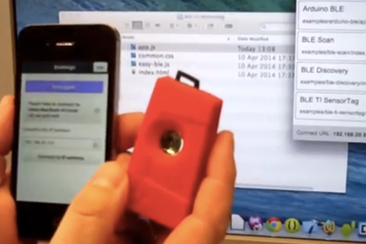
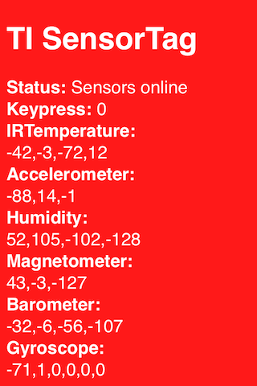

# Developing apps for TI SensorTag made easy

## Quickly develop apps for the TI SensorTag

This demo app shows how to quickly create a mobile app for the TI SensorTag using a high-level JavaScript library. With this library it is easy to write mobile apps in JavaScript and HTML for the SensorTag.

## The TI SensorTag

The [Texas Instruments TI SensorTag](http://www.ti.com/ww/en/wireless_connectivity/sensortag/) is a small device that features a range of sensors that can be used for various projects and applications.

Photo of the TI SensorTag:

There are several ways to develop applications for the SensorTag. Here we will show how to use a high-level JavaScript library, that makes it fast and easy to develop SensorTag apps.

## Demo app

The demo app showcases the TI SensorTag. Coded in JavaScript, the app runs on a mobile phone or tablet (Android or iOS). Input from the TI SensorTag is displayed on-screen in real time.

Screenshot from the app:

## In the code

The demo app consists of the following files:

* [index.html]() - the complete application code (HTML and JavaScript)
* [ti-sensortag.js]() - high-level TI SensorTag library
* [easy-ble.js]() - high-level BLE library

To read sensors on the SensorTag, the program must turn on sensors, enable notifications and so on, using BLE calls. The  TI SensorTag library abstracts the low-level BLE code, UUIDs etc, and provides high-level functions for enabling and reading sensors.

In total, the demo app is 77 lines of JavaScript code. Here is the complete listing:

    function initialiseSensortag()
    {
        var sensorTag = TISensorTag.createInstance()
        sensorTag
            .keypressCallback(keypressHandler)
            .irTemperatureCallback(irTemperatureHandler)
            .humidityCallback(humidityHandler)
            .barometerCallback(barometerHandler)
            .accelerometerCallback(accelerometerHandler, 100)
            .magnetometerCallback(magnetometerHandler, 100)
            .gyroscopeCallback(gyroscopeHandler, 100)
            .connectToClosestDevice()
    }

    function keypressHandler(data)
    {
        displaySensorValue(
            'KeypressData',
            'Keypress',
            data[0])
    }

    function irTemperatureHandler(data)
    {
        displaySensorValue(
            'IRTemperatureData',
            'IRTemperature',
            data[0] + ',' + data[1] + ',' + data[2] + ',' + data[3])
    }

    function accelerometerHandler(data)
    {
        displaySensorValue(
            'AccelerometerData',
            'Accelerometer',
            data[0] + ',' + data[1] + ',' + data[2])
    }

    function humidityHandler(data)
    {
        displaySensorValue(
            'HumidityData',
            'Humidity',
            data[0] + ',' + data[1] + ',' + data[2] + ',' + data[3])
    }

    function magnetometerHandler(data)
    {
        displaySensorValue(
            'MagnetometerData',
            'Magnetometer',
            data[0] + ',' + data[1] + ',' + data[2])
    }

    function barometerHandler(data)
    {
        displaySensorValue(
            'BarometerData',
            'Barometer',
            data[0] + ',' + data[1] + ',' + data[2] + ',' + data[3])
    }

    function gyroscopeHandler(data)
    {
        displaySensorValue(
            'GyroscopeData',
            'Gyroscope',
            data[0] + ',' + data[1] + ',' + data[2] + ','
            + data[3] + ',' + data[4] + ',' + data[5])
    }

    function displaySensorValue(elementId, label, value)
    {
        document.getElementById(elementId).innerHTML = label + ':&lt;br/&gt;' + value
    }

    document.addEventListener('deviceready', initialiseSensortag, false)

When the app starts, the **initialiseSensortag** function is called. This function creates a SensorTag object that we use to enable sensors. The API for defining sensors uses a "fluent" style, where you chain together function calls.

For each sensor you wish to use, a callback function is given. This function will be called when sensor values are updated. Some sensors have a setting for the update interval, given in milliseconds.

As the final initialisation step, the function **connectToClosestDevice** is called. This makes the app scan for and connect to the SensorTag with the strongest RSSI (signal strength) value.

The callback functions take a data parameter, that contains an array of sensor values (byte values). The number of data values differ depending on the sensor. For the full documentation of sensors and sensor values, see  [SensorTag_User_Guide](http://processors.wiki.ti.com/index.php/SensorTag_User_Guide) and
[BLE_SensorTag_GATT_Server.pdf](http://processors.wiki.ti.com/index.php/File:BLE_SensorTag_GATT_Server.pdf).

## Running the app using Evothings Studio

The TI SensorTag app has been developed using [**Evothings Studio**](http://evothings.com/download).

When developing apps with Evothings Studio, you run the Evothings Client app on your mobile device to execute the application, and you use Evothings Workbench on your laptop/desktop machine, running a live-reload server.

To run the app, do as follows:

* Install the **Evothings Client** app on your iOS or Android device (available in the AppStore and on Google Play)
* [Download Evothings Studio](http://evothings.com/download)
* Grab the [source code for the TI SensorTag app](https://github.com/divineprog/evo-demos/tree/master/Demos2014/TISensorTag) from GitHub
* Drag and drop index.html anywhere in the project list window in the Evothings Workbench application running on your computer
* Connect from Evothings Client to the Workbench
* Press Run in the Workbench
* Make sure the SensorTag is in announce mode
* Live sensor data is displayed on the screen

## Fun things to do

You can modify the app in various ways. Play around with the source code, find out how to use Evothings Studio to quickly see your changes on the mobile device.

## Using BLE from JavaScript

The TI SensorTag uses Bluetooth Low Energy (BLE) to communicate with your phone or tablet. To access BLE from JavaScript, the [Evothings BLE plugin for Apache Cordova](https://github.com/evothings/cordova-ble) is used.

Files of interest:

* [ble.js](https://github.com/evothings/cordova-ble/blob/master/ble.js) is the API for the BLE plugin. This file built into the Evothings Client app (which is built with Cordova), and is not included in the source code for the app.
* [easy-ble.js](https://github.com/divineprog/evo-demos/blob/master/Demos2014/TISensorTag/easy-ble.js) is a high-level abstraction of the API in ble.js.
* [ti-sensortag.js](https://github.com/divineprog/evo-demos/blob/master/Demos2014/TISensorTag/ti-sensortag.js) is a high-level library for the TI SensorTag.

The documentation for the UUIDs used by SensorTag services and characteristics is found here: [SensorTag_User_Guide](http://processors.wiki.ti.com/index.php/SensorTag_User_Guide),
[BLE_SensorTag_GATT_Server.pdf](http://processors.wiki.ti.com/index.php/File:BLE_SensorTag_GATT_Server.pdf).

## Building a native app

Any app you create using Evothings Studio can be packaged as a native Apache Cordova app, that can then be published on the app stores. The Evothings Client app itself is a Cordova app, and it was even developed using Evothings Workbench!

How to build a native app with Cordova is described in the [Evothings Build Documentation](http://evothings.com/doc/build/build-overview.html).

## More examples

Magic Stone:

http://evothings.com/magic-stone-make-mobile-iot-applications-using-the-ti-sensortag-in-javascript/

## Share your projects

Announce your apps and keep the discussion going on the [Evothings Forum](http://forum.evothings.com/).

[Evothings Studio](http://evothings.com/) is a development tool that makes it fun to develop IoT-apps for mobile phones and tablets.
